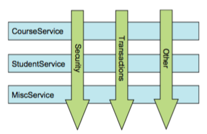
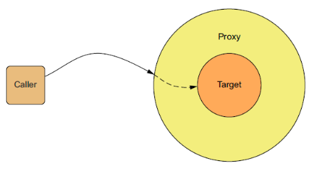

## 什么是AOP

在上一章的学习中，我们知道Spring一直致力于简化我们的Java开发，并且用到了依赖注入（Dependency  Injection）与AOP（Aspect-Oriented Programming）这两项非常重要的技术：

+ DI主要解决了在类和类之间有依赖关系的时候，如何通过注入的方式（属性注入、构造器注入）形成松耦合

+ 而今天要学习的AOP则是考虑如何把散落在应用中多处相同的功能剥离出来，使得这些剥离出来的逻辑与业务逻辑相分离的问题。

  

让我们先来看一个生活中的案例：

> 每家每户都有一个电表来监控用电量，这样电力公司就知道应该收取多少费用了。虽然每一台用电设备都可以自装一个用电统计的硬件，但这样是极不合理，成本上也不划算的，因为每个用电设备更多关注的是自身的功能是否完善的问题，吸尘器考虑的是清洁效果，微波炉考虑的是加热效果等等。电力公司只需要在合适的地方，比如用电线路入户的地方，统一安装一个电表，就能很好的解决监控所有用电设备电量的问题。

软件系统中的一些功能就像我们家里的电表一样。这些功能需要用到应用程序的多个地方，但是我们又不想在每个点都明确调用它们。



在软件开发中，散布于应用中多处的功能，被称为**横切关注点**（cross-cutting concern）。通常来讲，这些横切关注点从概念上是与应用的业务逻辑相分离的（但往往会直接嵌入到应用的业务逻辑中）。把这些横切关注点与业务逻辑相分离正是AOP所要解决的问题。

## 代理模式

1. ### 代理模式的概念

   AOP在实现上采用了设计模式中的动态代理模式，因此，在深入学习SpringAOP之前，我们先来一起了解和学习一下这种强大的设计模式。

   

   代理模式的定义：为其他对象提供一种代理，以控制对这个对象的访问。换句通俗的话来说，它是一种使用代理对象来执行目标对象的方法，并在代理对象中增强目标对象方法的一种设计模式。

   

   生活中最常见的代理模式就是”中介“。假如说我现在想买一辆二手车，虽然我可以自己去找车源，做质量检测等一系列的车辆过户流程，但是这确实太浪费我得时间和精力了。我只是想买一辆车而已为什么我还要额外做这么多事呢？于是我就通过中介公司来买车，他们来给我找车源，帮我办理车辆过户流程，我只是负责选择自己喜欢的车，然后付钱就可以了。

   

   代理模式的功能主要是起到增强方法和权限拦截的作用。

   

2. ### 代理模式的好处

   从上图我们可以看出，在程序设计中使用代理模式的一些好处：

   + 中介隔离：在调用方（Caller）不能或不想直接与目标对象（Target）打交道的时候，代理对象（Proxy）可以起到两者之间中介的作用。
   + 开闭原则：我们可以通过给代理对象增加新的功能来扩展目标对象的功能，这样我们只需要修改代理类，而不需要修改目标类，符合代码设计的OCP原则（Open Closed Principle，对扩展是开放的，对修改是关闭的）。

3. ### 代理模式的种类

   根据代理对象创建的不同，分为两种代理模式：

   + 静态代理：由程序员或者特定工具生成源代码来产生代理对象。在程序运行前，代理类的字节码文件（.class）就已经存在了
   + 动态代理：在程序运行期间，运用反射机制、字节码生成技术来产生代理类和实例。

## 静态代理模式

### Proxy---代理

​	要实现静态代理，我们首先使用接口的方式来封装被代理的行为：

​	接口：

```java
public interface IUserDao {
    void save();
}
```

分别让目标和代理都来实现这个接口，这样，对于调用方来说，无论和代理还是目标打交道，执行的代码都是一致的，都可以执行相同的行为。

```java
public class UserDaoImpl implements IUserDao {
    @Override
    public void save() {
        System.out.println("用户数据保存！");
    }
}
```

为目标方编写对应的代理类，在其中增加新的服务功能：

```java
package com.tuling.dao;
public class UserDaoProxy implements IUserDao{

    private IUserDao userDao;

    public UserDaoProxy(IUserDao userDao) {
        this.userDao = userDao;
    }
    @Override
    public void save() {
        System.out.println("开启事务...");
        userDao.save();//执行目标对象方法
        System.out.println("提交事务...");
    }
}
```

从上面可以看到，我们最终让客户执行了购买行为，除此之外，为了让客户享受更为完善的服务，我们还扩展了寻找车源、质量检测、售后咨询等其它服务。在一个复杂的应用中，我们当然不是仅仅打印几行字，我们可以封装单独的方法来做这些事情，甚至还可以调用其它的类来执行这些辅助逻辑。

测试代码：

```java
package com.tuling.dao;
public class MainTest {
    public static void main(String[] args) {
        //目标对象
        UserDaoImpl userDao = new UserDaoImpl();
        //代理对象
        UserDaoProxy proxy = new UserDaoProxy(userDao);
        //执行代理对象的方法
        proxy.save();
    }

    /*
 * 静态代理总结：
 * 1、可以做到在不修改目标对象的功能前提下，增强目标对象。
 * 2、但是由于要和目标对象实现相同的接口，如果目标方法过多，或
者
 * 目标对象一旦新增方法，代理对象都要一并维护。
 */
}
```

## 动态代理模式

静态代理模式最大的缺陷就是，我们需要为每一个被代理的目标类都编写一个代理类。而动态代理可以很好的解决这个问题。JDK的Proxy和开源框架CGLIB可以分别在不同的情况帮助我们生成代理。

+ #### JDK动态代理

当目标的被代理方法抽取了接口时，可以使用JDK Proxy。

接口：

```java
package com.tuling.proxy;
/**
* 接口
* @author fred
*
*/
public interface IUserDao {
    void save();
}
```

目标类：

```java
package com.tuling.proxy;
public class UserDaoImpl implements IUserDao {
    @Override
    public void save() {
        System.out.println("用户数据保存！");
    }
}
```

测试类：

```java
package com.tuling.proxy;
import java.lang.reflect.InvocationHandler;
import java.lang.reflect.Method;
import java.lang.reflect.Proxy;
public class MainTest {
    public static void main(String[] args) {
        //目标对象
        UserDaoImpl userDao = new UserDaoImpl();
        //代理对象
        IUserDao proxy = (IUserDao) Proxy.newProxyInstance(
            userDao.getClass().getClassLoader(), //目标对
            象的类加载器
            userDao.getClass().getInterfaces(), //目标对
            象的接口数组
            new InvocationHandler() {//事件处理，执行目标对
                象的方法时，会触invoke方法

                    @Override
                    public Object invoke(Object proxy, Method
                                         method, Object[] args) throws Throwable {
                    System.out.println("开启事务...");
                    //执行目标对象方法
                    Object obj = method.invoke(userDao,
                                               args);
                    System.out.println("提交事务...");
                    return obj;
                }
            });
        //调用代理对象方法
        proxy.save();

        /*
 * JDK动态代理总结：
 * 1、目标对象必须要有接口，否则不能实现动态代理。
 * 2、代理对象必须强转为接口类型。
 */
    }
}
```

`invoke`方法会在代理对象的被代理方法调用的时候触发。

## CGLIB

当目标类没有实现接口时，我们可以通过开源的CGLIB来实现。

使用maven引入cglib库：

```xml
<dependency>
    <groupId>cglib</groupId>
    <artifactId>cglib</artifactId>
    <version>3.3.0</version>
</dependency>
```

也可以引入spring-core库，该库中包含了CGLIB。

```xml
<dependency>
    <groupId>org.springframework</groupId>
    <artifactId>spring-core</artifactId>
    <version>5.1.2.RELEASE</version>
</dependency>
```

目标类：

```java
package com.tuling.cglib;
/**
* 目标对象，没有任何接口
* @author fred
*
*/
public class UserDaoImpl{
    public void save() {
        System.out.println("用户数据保存！");
    }
}
```

代理工厂类：

```java
package com.tuling.cglib;
import java.lang.invoke.MethodHandleInfo;
import java.lang.reflect.Method;
import net.sf.cglib.proxy.Enhancer;
import net.sf.cglib.proxy.MethodInterceptor;
import net.sf.cglib.proxy.MethodProxy;
public class ProxyFactory implements MethodInterceptor{

    //目标对象
    private Object target;
    public ProxyFactory(Object target) {
        super();
        this.target = target;
    }

    //给目标对象创建一个代理对象
    public Object getProxyInstance(){
        //1.增强器
        Enhancer en = new Enhancer();
        //2.设置目标对象的类加载器
        en.setClassLoader(target.getClass().getClassLoader());
        //3.设置这个动态代理类的父类
        en.setSuperclass(target.getClass());
        //4.设置要传入的拦截器
        en.setCallback(this);
        //5.创建子类(代理对象)
        return en.create();
    }
    @Override
    public Object intercept(Object arg0, Method method,
                            Object[] args, MethodProxy arg3) throws Throwable {
        System.out.println("开启事务...");
        //执行目标对象的方法
        Object obj = method.invoke(target, args);
        System.out.println("提交事务...");
        return obj;
    }
}
```

测试类：

```java
package com.tuling.cglib;
public class MainTest {
    public static void main(String[] args) {
        //目标对象
        UserDaoImpl userDao = new UserDaoImpl();
        //代理对象
        UserDaoImpl proxy =
            (UserDaoImpl) new ProxyFactory(userDao).getProxyInstance();
        //执行代理对象方法
        proxy.save();
    }
}
```

## 总结

+ 静态代理需要自己手动编写代理类和目标方法。

+ 动态代理就不需要自己手动实现代理类和目标方法，但动态代理的目标类要必须实现接口！

+ Cglib 代理的目标类就不需要实现接口！但目标类不能被final修饰！

  

**Spring AOP 编程的实现原理就是 动态代理和Cglib 代理，当目标类实现接口时使用动态代理，没有则Cglib代理。**