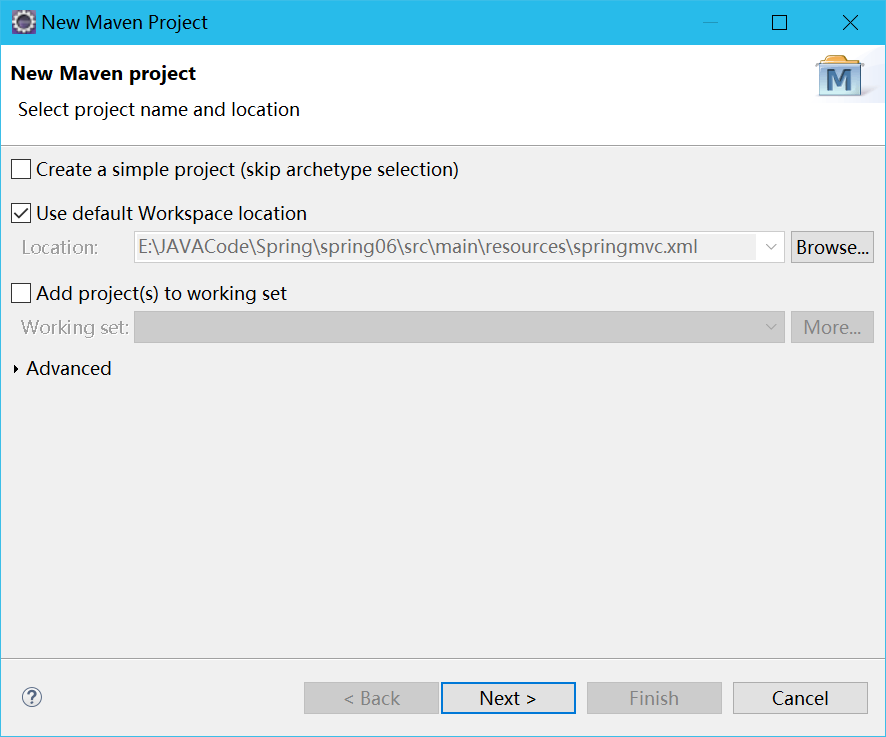
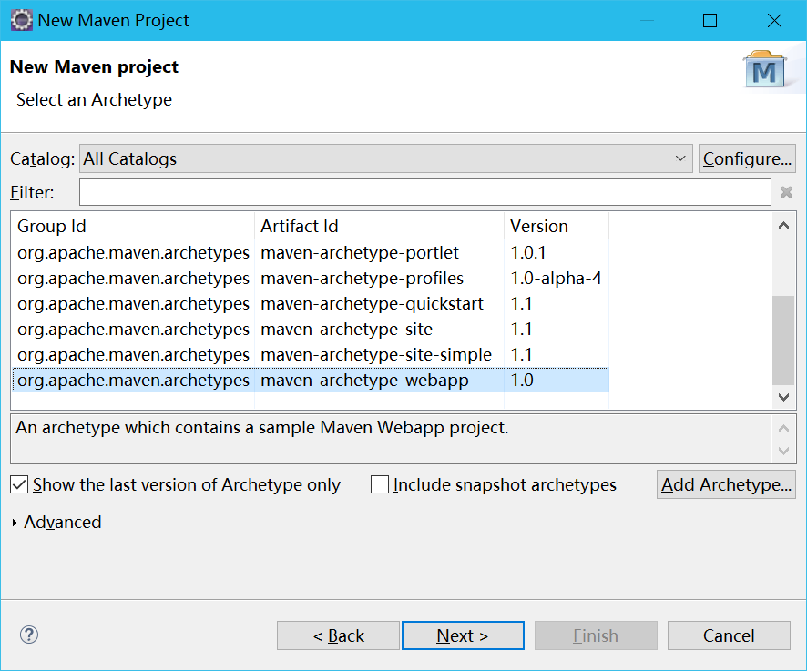
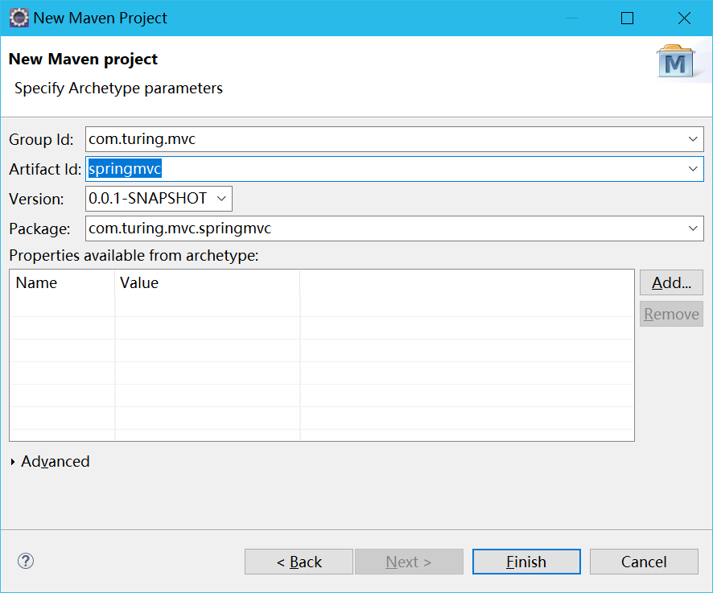
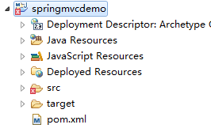
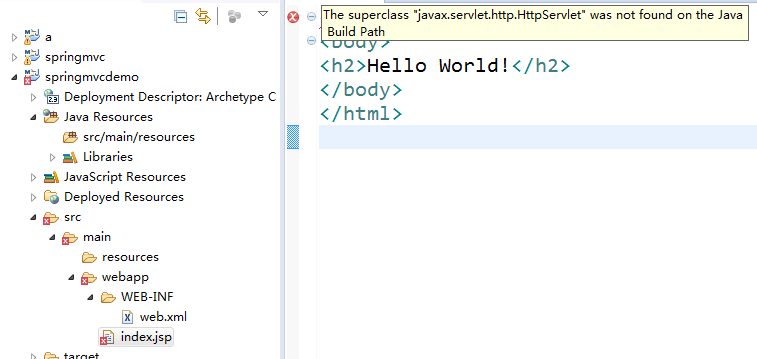
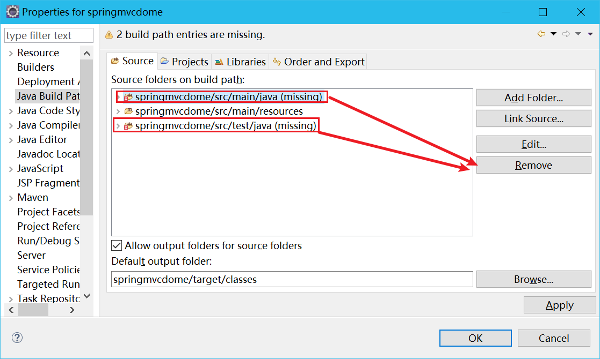
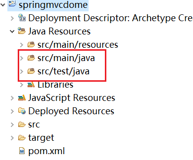
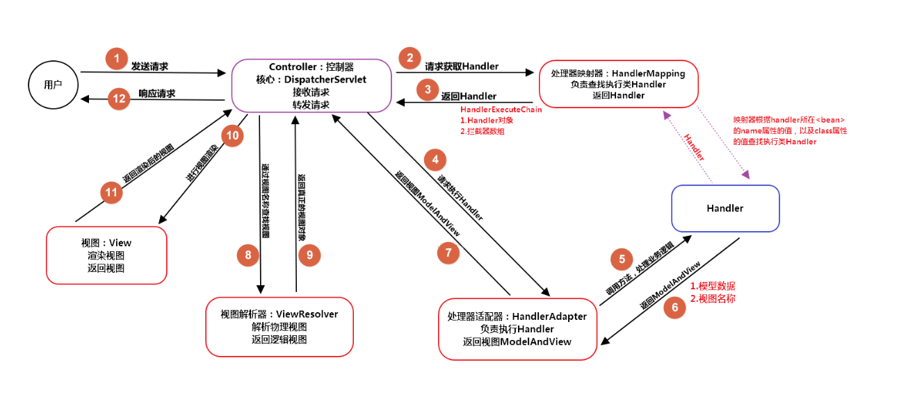

## SpringMVC简介

在之前，我们曾学过基于MVC思想的struts2框架，而Spring本身对于Web开发也提供了一个非常强大的解决方案。SpringMVC基于模型-视图-控制器（Model-View-Controller，MVC）模式实现，它能够帮助我们构建更为灵活和松耦合的Web应用程序。

SpringMVC得益于自身两大核心技术DI和AOP的运用，使得我们可以在Web项目中以更优雅和更健壮的方式引入、整合各类资源。目前，SpringMVC在Web框架的市场份额上，已经遥遥领先于struts2等传统Web框架。

## 使用Eclipse搭建Maven web项目

1. 创建一个maven项目，第一步默认，点击**Next**

   

2. 选择最后一个模板：webapp,点击**Next**

   

3. 依次填写Group ID,Artifact ID,包名将自动填写。点击**Finish**

   

4. 项目创建完毕，但是报错

   

5. 第一个错误，缺少HttpServlet这个库，需要在pom.xml中引入这个库

   

   解决方法：

   加入Servlet依赖：

   ```xml
   <!-- 引入Servlet的依赖 -->
   <dependency>
       <groupId>javax.servlet</groupId>
       <artifactId>javax.servlet-api</artifactId>
       <version>3.0.1</version>
   </dependency>
   ```

   

6. 第二个错误，手动删掉原本项目中报错的两个资源包，java和test。

   

   然后手动创建。

   

## SpringMVC流程图



1. 用户发起请求到前端控制器（DispatcherServlet），该控制器会过滤出哪些请求可以访问Servlet、哪些不能访问。就是url-pattern的作用，并且会加载springmvc.xml配置文件。
2. 前端控制器会找到处理器映射器（HandlerMapping），通过HandlerMapping完成url到controller映射的组件，简单来说，就是将在springmvc.xml中配置的或者注解的url与对应的处理类找到并进行存储，用map<url,handler>这样的方式来存储。
3. HandlerMapping有了映射关系，并且找到url对应的处理器，HandlerMapping就会将其处理器（Handler）返回，在返回前，会加上很多拦截器。
4. DispatcherServlet拿到Handler后，找到HandlerAdapter（处理器适配器），通过它来访问处理器，并执行处理器。
5. 执行处理器
6. 处理器会返回一个ModelAndView对象给HandlerAdapter
7. 通过HandlerAdapter将ModelAndView对象返回给前端控制器(DispatcherServlet)
8. 前端控制器请求视图解析器(ViewResolver)去进行视图解析，根据逻辑视图名解析成真正的视图(jsp)，其实就是将ModelAndView对象中存放视图的名称进行查找，找到对应的页面形成视图对象
9. 返回视图对象到前端控制器。
10. 视图渲染，就是将ModelAndView对象中的数据放到request域中，用来让页面加载数据的。
11. 返回渲染后的视图。
12. 通过第8步，通过名称找到了对应的页面，通过第10步，request域中有了所需要的数据，那么就能够进行视图渲染了。最后将其返回即可。

<font color=red>SpringMVC的核心控制器是Servlet，而Struts2的核心控制器是过滤器(Filter)</font>

## 使用SpringMVC

1. 在前面创建的Maven web项目中加入依赖

   ```xml
   <dependency>
       <groupId>org.springframework</groupId>
       <artifactId>spring-webmvc</artifactId>
       <version>5.1.9.RELEASE</version>
   </dependency>
   ```

2. 注册前端控制器

   ```xml
   <servlet>
       <servlet-name>DispatcherServlet</servlet-name>
       <servlet-class>org.springframework.web.servlet.DispatcherServlet</servlet￾class>
       <init-param>
           <!-- 修改默认配置文件的路径和名称 -->
           <param-name>contextConfigLocation</param-name>
           <param-value>classpath:springmvc.xml</param-value>
       </init-param>
       <!-- 服务器启动的时候就创建前端控制器 -->
       <load-on-startup>1</load-on-startup>
   </servlet>
   <servlet-mapping>
       <servlet-name>DispatcherServlet</servlet-name>
       <url-pattern>/</url-pattern>
   </servlet-mapping>
   ```

3. 在类路径下创建springmvc.xml配置文件

   ```xml
   <?xml version="1.0" encoding="UTF-8"?>
   <beans xmlns="http://www.springframework.org/schema/beans"
          xmlns:tx="http://www.springframework.org/schema/tx"
          xmlns:aop="http://www.springframework.org/schema/aop"
          xmlns:context="http://www.springframework.org/schema/context"
          xmlns:mvc="http://www.springframework.org/schema/mvc"
          xmlns:xsi="http://www.w3.org/2001/XMLSchema-instance"
          xsi:schemaLocation="http://www.springframework.org/schema/beans
                              https://www.springframework.org/schema/beans/spring-beans.xsd
                              http://www.springframework.org/schema/tx
                              https://www.springframework.org/schema/tx/spring-tx.xsd
                              http://www.springframework.org/schema/aop
                              https://www.springframework.org/schema/aop/spring-aop.xsd
                              http://www.springframework.org/schema/context
                              https://www.springframework.org/schema/context/spring-context.xsd
                              http://www.springframework.org/schema/mvc
                              https://www.springframework.org/schema/mvc/spring-mvc.xsd">
       
   </beans>
   ```

   


### 如何创建一个控制器

1. #### 使用xml配置方式

   + 写一个类实现org.springframework.web.servlet.mvc.Controller重写handleRequest方法

     ```java
     package com.turing.controller;
     import javax.servlet.http.HttpServletRequest;
     import javax.servlet.http.HttpServletResponse;
     import org.springframework.web.servlet.ModelAndView;
     import org.springframework.web.servlet.mvc.Controller;
     /**
     * 实现接口的方式
     * @author fred
     *
     */
     public class HelloController implements Controller{
         @Override
         public ModelAndView handleRequest(HttpServletRequest
                                           request, HttpServletResponse response) throws Exception {
             System.out.println("Hello SpringMVC");
             return null;
         }
     }
     ```

   + 在springmvc.xml中配置该控制器

     ```xml
     <?xml version="1.0" encoding="UTF-8"?>
     <beans xmlns="http://www.springframework.org/schema/beans"
            xmlns:tx="http://www.springframework.org/schema/tx"
            xmlns:aop="http://www.springframework.org/schema/aop"
            xmlns:context="http://www.springframework.org/schema/context"
            xmlns:mvc="http://www.springframework.org/schema/mvc"
            xmlns:xsi="http://www.w3.org/2001/XMLSchema-instance"
            xsi:schemaLocation="http://www.springframework.org/schema/beans
                                https://www.springframework.org/schema/beans/spring-beans.xsd
                                http://www.springframework.org/schema/tx
                                https://www.springframework.org/schema/tx/spring-tx.xsd
                                http://www.springframework.org/schema/aop
                                https://www.springframework.org/schema/aop/spring-aop.xsd
                                http://www.springframework.org/schema/context
                                https://www.springframework.org/schema/context/spring-context.xsd
                                http://www.springframework.org/schema/mvc
                                https://www.springframework.org/schema/mvc/spring-mvc.xsd">
     
         <!-- 注册HelloController控制器-->
         <bean id="/hello" class="com.turing.controller.HelloController"></bean>
     
     </beans>
     ```

     

   2. #### 注解的方式

      1. 不用实现Controller接口，而是在类上面使用@Controller注解

         ```java
         @Controller
         public class StuController {
         
         }
         ```

      2. 在方法上使用@RequestMapping("/url")

         ```java
         @Controller
         public class StuController {
         
             @RequestMapping("/url")
             public ModelAndView handleRequest(HttpServletRequest
                                               request, HttpServletResponse response) throws Exception{
         
             }
         }
         ```

         + 如果方法没有参数，返回类型必须是ModelAndView 。
         + 如果方法没有返回类型，参数中必须要有一个HttpServletResponse类型。

      3. 在springmvc.xml中配置扫描器,在springmvc.xml中加入

         ```xml
         <context:component-scan base-package="com.tuling.controller">
         </context:component-scan>
         ```

      4. 开启mvc注解（新版本可以省略），在springmvc.xml中加入

         ```xml
         <mvc:annotation-driven/>
         ```

         

## ModelAndView

ModelAndView可以把数据和视图整合在一起，交给页面。

例如：我们要往hello.jsp传递一个msg的参数：

```java
@RequestMapping("/test2")
public ModelAndView handleRequest(HttpServletRequest
                                  request, HttpServletResponse response) throws Exception {
    System.out.println("HelloController run...");
    //模型和视图对象
    ModelAndView mav = new ModelAndView();
    //设置参数
    mav.addObject("msg", "hello springmvc222");
    //设置视图
    //setViewPath
    mav.setViewName("/hello.jsp");
    return mav;
}
```

## 细节问题

web.xml中的通配符

`/ `指的是tomcat中的一个默认控制器。如果我们在SpringMVC中也配置了这个通配符，那么就覆盖了默认控制器，那么对静态资源的访问，就不行了。需要我们去配置一个可以访问静态资源的。在springmvc.xml中加入

```xml
<!-- 运行访问静态资源 -->
<mvc:default-servlet-handler/>
```

常见的通配符

`/*`

`*.do`

`*.action`

`*.abc`