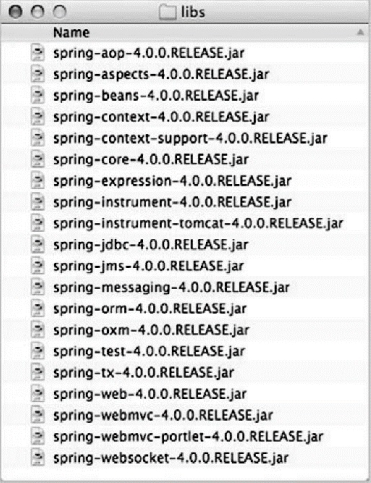

## Why Spring?

Spring makes programming Java quicker, easier, and safer for everybody. Spring’s focus on speed, simplicity, and productivity has made it the [world's most popular](https://snyk.io/blog/jvm-ecosystem-report-2018-platform-application/) Java framework.

为什么使用Spring?

Spring使Java编程对每个人来说更快、更容易、更安全。Spring对速度、简单性和生产力的关注使其成为世界上最流行的Java框架。

## Spring简介

Spring是由Rod Johnson创建的目前使用非常广泛的开源框架。很难用一句简单的描述概括它的基本功能，

Spring家族几乎可以解决我们在开发JavaEE项目中所有的问题，但Spring创建的初衷是为了解决企业级应用

开发的复杂性，并致力于全方位简化Java开发。

对于Java开发者来说，Spring是一个非常著名的框架。无论在什么Java方向的开发领域，Spring都有他的一

席之地。在网上的资料可以知道，Spring是一个开源的框架，其官网地址为：Spring官网http://spring.io


为了降低Java开发的复杂性，Spring采取了以下4种关键策略：

+ 基于POJO的轻量级和最小侵入性编程；

+ 通过依赖注入和面向接口实现松耦合；

+ 基于切面和惯例进行声明式编程；

+ 通过切面和模板减少样板式代码。

  

IOC:Inversion of Controller 控制反转

DI:Dependency Injection 依赖注入

 ---属性注入

 ---构造器注入

AOP:Aspect-Oriented Programming 面向切面编程---JDK动态代理---反射

我们一般会把Spring容器称为IOC容器。

类：A.java--->B.java A依赖B，

```java
 A(){
	 B b = new B();//A负责B的实例化。
 }
```

 容器：装东西的都叫容器。数组、集合/

 Spring容器：专门生产Bean的容器

类：B.java

Spring框架通过<font color='red'>依赖注入</font>（Dependency Injection，DI）和<font color='red'>面向切面编程</font>（Aspect-Oriented

Programming，AOP）2项核心技术，来贯彻和执行上述4项策略。在后面的学习中，我们将深入分析DI和

AOP是如何简化我们的Java开发的。

## spring模块和家族

+ ### Spring模块

  ​	在spring4.0版本中，共包含20个不同的模块，可以划分为6类不同的功能

  ​	

  Spirng Framework Modules（Spring框架的模块）由Core Container（核心容器）、Data Access/Integration（数据读取和数据整合）、Web、AOP（面向切面编程）、Instrumentation（工具）、Messaging（消息传递）和Test共7部分组成，如下图所示：

  

  ####  1. Core Container（核心容器）

  **Core Container**是由spring-core（spring的核心）、spring-beans（spring里面的类||元素）、spring-context（spring的上下文）、spring-context-support（spring上下文的支持）和spring-expression（spring的表达式）模块组成。

  **spring-core和spring-beans模块**，包括IoC和依赖注入。BeanFactory是工厂模式的复杂implementation（容器），它消除了对程序化单例的需求，并允许您从实际程序逻辑中分离结构和依赖项规范（这段话个人理解：spring-beans将单一的程序结构，分成多个，您可以使用spring-beans将结构和依赖分离）。

  **Context**（spring-context）构建在核心（spring-core）和Beans（spring-beans）之上：Context是以framework-style（框架样式）的方式来访问object的方法，类似于**JNDI注册表**（标准的Java命名和目录接口），Context模块是从Beans模块继承其特征并添加对国际化的使用，例如资源包、event（事件）传播，资源加载以及透明的上下文创建的支持，例如Servlet容器。还支持JavaEE的特征，例如：EJB、JMX和基本远程处理，ApplicationContext接口是Context模块的焦点。

  **spring-context-support**支持common-third-party libraries（公共的第三方库）集成到Spring Context Application（spring应用上下文），用于缓存（EhChache）、邮件（JavaMail）、调度（CommonJ、Quartz）、模板引擎（FreeMarker）。

  **spring-expression**模块提供的是一个强大的表达语言（EL表达式），用于在运行时查询和操作object（对象）图，该语言支持设置和获取property的值，property赋值、方法调用、访问数组、集合和索引器的内容。

  #### 2. AOP和Instrumentation（工具）

  **spring-aop**模块面向切面编程，允许在example（例子）上定义方法拦截器和切入点，以干净解耦的方式实现应该分离的code（代码）。

  **spring-aspects**模块提供与AspectJ的 integration（整合）。

  **spring-instrument**模块提供class检测支持和类加载器instrumentations（实现）在某些application服务器中使用。

  **spring-instrument-tomcat**模块包含Spring对Tomcat的检测代理。

  #### 3. Messaging消息

  在Spring Framework中，包括一个spring-messaging模块，其中包括来自spring整合项目的key抽象，例如Message（消息）、MessageChannel（消息会话）、MessageHeadler（消息处理程序）等，用来作为messaging-based-applications（基于消息的应用程序）的基础，该模块还包括annotations（注解），用于将消息映射到方法上。

  #### 4. Data Access/ Data Integration（数据存取和数据整合）

  Data Access/ Data Integration层是由JDBC、ORM、OXM、JMS和Transient模块组成。

  **spirng-jdbc**模块提供了JDBC-abstraction（抽象）层，不需要进行繁琐的JDBC编码和解析database-vendor（特定错误代码）

  **spring-tx**模块支持程序性和声明性transaction（事务）management（管理）用于实现特殊接口的classes和所有的POJO。

  **spring-orm**模块包括JPA、JDO和Hibernate。

  **spring-oxm**模块包括JAXB、Castor、XMLBeans、JiBX和XStream

  **spring-jms**模块（Java消息传递服务）包含用于producing和consuming消息的特征。

  #### 5. Web

  Web层是由：spring-web、spring-webmvc、spring-websocket和spring-webmvc-portlet模块组成。

  **spring-web**模块提供基本的web-oriented integration features（面向web的集成特征），例如：multipart文件上传下载功能和使用 Servlet listeners （服务监听器）和 web-oriented application context （面向web应用程序上下文）初始化 IoC 容器。还包括HTTP Client和Spring远程支持的web-related（网络相关）部分。

  **spring-webmvc**模块包含了Spring的model、view、controller（MVC）。

  **spring-webmvc-portlet**模块提供了在Portlet环境中使用的MVC的implementation（实施），并且 mirrors Servlet-**based spring-webmvc** （基于springmvc的镜像）模块的功能。

  #### 6. Test

  **spring-test** 模块使用 JUnit 或 TestNG 支持单元测试和整合测试 Spring 组件。它提供了loading的
  Spring ApplicationContext 和高速缓存这些上下文。它还提供mock objects，您可以使用它来隔离
  测试您的 code

+ ### Spring家族项目

  概括地讲，整个Spring家族几乎为每一个领域的Java开发都提供了Spring编程模型，在Spring官网上可以

  看到除开核心框架之外的一些项目：

  + Spring Boot 可以使得我们更简便和快速的构建Spring应用
  + Spring Cloud Spring微服务
  + Spring Data 方便在Spring中使用任何数据库、
  + Spring Security 安全框架
  + 更多...http://spring.io/projects

  

## HelloWorld

1. ### 创建bean的传统方式

   在使用Spring之前，让我们先来看一份简单的Java程序清单：

   ```java
   //用来封装针式打印机类型
   public class PinPrinter {
    
        public void print() {
           System.out.println("使用针孔打印机进行打印");
        }
   }
   //用来封装激光打印机类型
   public class LaserPrinter {
    
        public void print() {
           System.out.println("使用激光打印机进行打印");
        }
   }
   //用来封装打印店，提供打印服务
   public class PrintHouse {
    	private PinPrinter printer;// 1-依赖
       
        public void service() {
            printer = new PinPrinter();// 2-硬编码造成高耦合
            printer.print();
        }
   }
   ```

   如上代码所述，任何一个有意义的应用，都会由两个或者更多的类组成，这些类相互之间进行协作来完成特

   定的业务逻辑。按照传统的做法，每个对象负责管理与自己相互协作的对象的引用（即它所依赖的对象），

   这将会导致高度耦合和难以测试的代码。

   

   从以上代码，我们来理解一下耦合（代码关联）的两面性：

   + 一方面，一定程度的耦合是必须的，完全没有耦合的代码什么都做不了。在代码1处，PrintHouse如果不

   借助PinPrinter类，就无法提供打印功能。

   + 另一方面，紧密耦合的代码难以测试、难以复用。为何这么说呢？在代码2处，由于自行创建了PinPrinter

   实例，导致PrintHouse和PinPrinter紧密的耦合在了一起，这虽然满足了用户的需求，但在一定程度上也限

   制了PrintHouse提供更为丰富灵活的功能，比如，万一用户要使用激光打印的话，那么现在PrintHouse如

   果不修改代码是满足不了需求的。

   

2. ### 使用Spring的方式

   1. 首先，创建maven项目，并引入Spring类库。配置pom.xml文件。

      ```xml
      <dependency> 
      	<groupId>org.springframework</groupId>
       	<artifactId>spring-context</artifactId>
      	<version>4.3.20.RELEASE</version>
      	<scope>runtime</scope>
      </dependency>
      ```

      查看maven下载的库

      

      打开pom的依赖树状结构图我们可以看到如下关系：

      

      spring-context这个模块，依赖了spring-aop，spring-beans，spring-core，spring-expression这样一

      些模块，借助maven的类库依赖管理，这些jar都会一并导入到项目中来，而其中前三个模块，就包含和提

      供了我们在开篇所提到的spring所具备的两项核心技术：依赖注入DI和面向切面编程AOP。在普通的非web

      应用中，我们一般只需要引入spring-context这个模块就可以满足基本需求了。

   2. 创建Spring配置文件，添加applicationContext.xml配置文件。

      ```xml
      <?xml version="1.0" encoding="UTF-8"?>
      <beans xmlns="http://www.springframework.org/schema/beans"
       xmlns:xsi="http://www.w3.org/2001/XMLSchema-instance"
       xsi:schemaLocation="http://www.springframework.org/schema/beans
      http://www.springframework.org/schema/beans/spring-beans.xsd">
           <!-- 配置针式打印机 -->
           <bean id="pinPrinter" class="com.tuling.spring.spring_demo.ioc.PinPrinter">
          </bean>
           <!-- 配置激光打印机 -->
           <bean id="laserPrinter" 		 class="com.tuling.spring.spring_demo.ioc.LaserPrinter"> 
          </bean>
           <!-- 配置打印店 -->
           <bean id="housePrinter" class="com.tuling.spring.spring_demo.ioc.HousePrinter">
           <!-- 属性注入 -->
           <property name="printer" ref="pinPrinter"></property>
           </bean>
      </beans>
      ```

   3. 测试代码

      ```java
      //使用Spring容器来创建bean这样的过程我们称为控制反转（IOC）
      	//所以我们有时候把创建bean的Spring容器称为IOC容器
      	//初始化Spring容器
      	ApplicationContext ctx = new ClassPathXmlApplicationContext("com/tuling/spring/spring_demo/ioc/applicationContext.xml");
      	//从容器中获取bean
           Printer pp = (Printer) ctx.getBean("pinPrinter");
           pp.print();
       
           //从容器中获取打印店
           HousePrinter hp = (HousePrinter) ctx.getBean("housePrinter");
           hp.service();
      ```

      从上述代码中，我们一起来看看这个一个spring应用中到底发生了什么：

      1. 通过读取配置文件信息，我们首先创建了spring容器，容器是spring框架一个非常重要的组件，它不光创建各个不同的bean（通过bean节点声明）还会创建相互协作的bean之间的关联（通过property节点进行属性的装配）

      2. 我们可以从容器中根据bean的id来获取bean的实例，调用bean的方法

      3. 最后使用完毕后，通过close方法进行容器销毁。

         在基于spring的应用中，对象都是生存于容器（<font color='grenn'>container</font>）中，spring容器负责创建对象、装配它们，配置它们并管理它们的整个生命周期，从生存到死亡（从<font color='grenn'>`new`</font>到<font color='grenn'>`finalize()`</font>）。

## IOC

### 名词解释：

IOC：控制反转（Inversion of Controller）<font color='red'>即“控制反转”，不是什么技术，而是一种设计思想。</font>

<table><tr><td bgcolor=yellow>控制反转简而言之就是把创建对象的控制权转移了，以前创建对象的主动权和创建时机是由自己把控的，而现在这种权力转移到第三方，比如转移交给了IoC容器，它就是一个专门用来创建对象的工厂，你要什么对象，它就给你什么对象，有了 IoC容器，依赖关系就变了，原先的依赖关系就没了，它们都依赖IoC容器了，通过IoC容器来建立它们之间的关系。</td></tr></table>

### 在IOC容器中装配Bean

#### 装配Bean

1. ##### xml文件

   ```xml
   <?xml version="1.0" encoding="UTF-8"?>
   <beans xmlns="http://www.springframework.org/schema/beans"
    xmlns:xsi="http://www.w3.org/2001/XMLSchema-instance"
    xsi:schemaLocation="http://www.springframework.org/schema/beans
   http://www.springframework.org/schema/beans/spring-beans.xsd">
    
        <!-- 装配bean -->
        <beans>
            <bean id="a" class="com.turing.maven.spring01.entity.A"></bean>
            <bean id="b" class="com.turing.maven.spring01.entity.B"></bean>
            <bean id="c" class="com.turing.maven.spring01.entity.C"></bean>
        </beans>
    
   </beans>
   ```

   

2. #### 测试

   ```java
   package com.turing.maven.spring01;
   import org.springframework.context.ApplicationContext;
   import org.springframework.context.support.ClassPathXmlApplicationContext;
   import com.turing.maven.spring01.entity.A;
   import com.turing.maven.spring01.entity.B;
   import com.turing.maven.spring01.entity.C;
   /**
   * Hello world!
   *
   */
   public class App
   {
        public static void main( String[] args )
        {
            //创建IOC容器
            ApplicationContext ctx = new ClassPathXmlApplicationContext("sp.xml");
            //从容器中获取bean
            A a = (A) ctx.getBean("a");
            B b = (B) ctx.getBean("b");
            C c = (C) ctx.getBean("c");
            //打印a
            System.out.println(a);
            System.out.println(b);
            System.out.println(c);
        }
   }
   ```

   

## DI

	### 名词解释：

DI：依赖注入（ <font color=red>**Dependency Injection**</font>） <font color=red>**即''依赖注入''**</font>：<font color=red>**组件之间依赖关系**</font>由容器在运行期决定。<font color=red>**IoC的一个重点是在系统运行中，动态的向某个对象提供它所需要的其他对象。这一点是通过DI（Dependency Injection，依赖注入）来实现的。**</font>

### 构造器注入

1. #### xml配置

   ```xml
   <!-- 装配bean -->
   <beans>
       <bean id="a" class="com.turing.maven.spring01.entity.A"></bean>
   
       <!-- 构造器注入 -->
       <bean id="b" class="com.turing.maven.spring01.entity.B">
           <constructor-arg ref="a"></constructor-arg>
       </bean>
   </beans>
   ```

2. #### 构造器传参

   ```java
   public class B {
        private A a;
    
        public B(A a){
        	this.a=a;
        }
    
        public void show(){
        	a.show();
        }
   }
   ```

3. #### 测试

   ```java
   public class App
   {
        public static void main( String[] args )
        {
        //创建IOC容器
        ApplicationContext ctx = new ClassPathXmlApplicationContext("sp.xml");
        //从容器中获取bean
        B b = (B) ctx.getBean("b");
        //调用方法
        b.show();
        }
   }
   ```

   

### set注入

1. #### xml配置

   ```xml
   <!-- 装配bean -->
   <beans>
       <bean id="a" class="com.turing.maven.spring01.entity.A"></bean>
       <!-- 属性注入 -->
       <bean id="c" class="com.turing.maven.spring01.entity.C">
           <property name="a" ref="a"></property>
       </bean>
   </beans>
   ```

2. #### set传参

   ```java
   public class C {
       private A a;
   
       public C(int a){
   
       }
   
       public C() {
   
       }
   
       public void setA(A a) {
           this.a = a;
       }
       public void show(){
           a.show();
       }
   
   }
   ```

   

3. #### 测试

   ```java
   package com.turing.maven.spring01;
   import org.springframework.context.ApplicationContext;
   import org.springframework.context.support.ClassPathXmlApplicationContext;
   import com.turing.maven.spring01.entity.A;
   import com.turing.maven.spring01.entity.B;
   import com.turing.maven.spring01.entity.C;
   /**
   * Hello world!
   *
   */
   public class App{
       public static void main( String[] args )
       {
           //创建IOC容器
           ApplicationContext ctx = new ClassPathXmlApplicationContext("sp.xml");
           //从容器中获取bean
           C c = (C) ctx.getBean("c");
   
           //调用方法
           c.show();
       }
   }
   ```

   

## 使用注解的方式Annotation

### 半xml配置半注解

配置文件中：只需要在配置文件中，添加组件扫描，bean的配置全部不需要了。

```xml
<?xml version="1.0" encoding="UTF-8"?>
<beans xmlns="http://www.springframework.org/schema/beans"
       xmlns:context="http://www.springframework.org/schema/context"
       xmlns:xsi="http://www.w3.org/2001/XMLSchema-instance"
       xsi:schemaLocation="http://www.springframework.org/schema/beans
                           http://www.springframework.org/schema/beans/spring-beans.xsd
                           http://www.springframework.org/schema/context
                           http://www.springframework.org/schema/context/spring-context.xsd">
    <!-- 组件扫描 -->
    <context:component-scan base-package="com.tuling.spring2"></context:componentscan>
</beans>
```

代码中：在对于的实体类名上打上注解：可以是以下四个中的某一个。

对于Spring来说，以下四个含义一样。

@Component 组件

@Service 业务

@Repository 仓库-DAO

@Controller 控制-Action

例如：激光打印机

```java
//此注解代表之前在配置文件中的<bean id="laserPrinter" class="...">
//默认id为类名首字母小写
//如果要改变类名，可以使用@Component(value="lp")，value可以省略不写
@Component
public class LaserPrinter implements Printer{
    public void print() {
        System.out.println("激光打印机打印...");
    }
}
```

例如：图文店

```java
@Component
//@Service 服务 业务层的bean
//@Controller 控制 控制层的bean
//@Repository 仓库 Dao层的bean
public class HousePrinter {

    @Autowired //使用属性注入
    @Qualifier("pinPrinter")//如果Printer类型有多个，可以指定限定名
    private Printer printer;//属性

    //set方法可以省略不写
    public void setPrinter(Printer printer) {
        this.printer = printer;
    }

    //服务
    public void service(){
        //打印
        printer.print();
    }
}
```

### 全注解

通过使用@Configuration注解，就类似于之前的xml配置文件。

通过使用@ComponentScan，就类似于之前的

```xml
<context:component-scan base-package="com.tuling.spring2"></context:component-scan>
```


```java
package com.tuling.spring3;
import org.springframework.context.ApplicationContext;
import org.springframework.context.annotation.AnnotationConfigApplicationContext;
importorg.springframework.context.annotation.ComponentScan;
import org.springframework.context.annotation.Configuration;
import org.springframework.context.support.ClassPathXmlApplicationContext;
@Configuration
@ComponentScan //扫描该类所在包及其子包
public class MainTest {
    public static void main(String[] args) {
        //使用半XML配置半注解的方式

        //1、初始化容器
        ApplicationContext ctx =
            new AnnotationConfigApplicationContext(MainTest.class);
        //2、从容器中获取bean
        // Printer bean = ctx.getBean("pinPrinter", Printer.class);//推荐使用
        // Printer bean = ctx.getBean(Printer.class);//如果类型有多个，就会 报错
        // Printer bean = (Printer) ctx.getBean("pinPrinter");//需要强转类型

        //3、调用bean的方法
        // bean.print();
        //----------------------------------------------------
        //获取图文店
        HousePrinter hp = ctx.getBean("housePrinter", HousePrinter.class);
        hp.service();
    }
}
```

