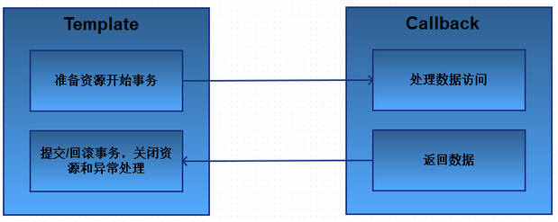

## Spring JDBC简介

<font size=4>数据是应用程序的血液，鉴于数据的重要地位，以健壮、简单和清晰的方式开发应用程序的数据访问部分就显得举足轻重了。</font>

<font size=4>在Java中，JDBC是与关系型数据库交互的最基本方式。但是按照规范，JDBC有些太笨重了。Spring能够解除我们使用JDBC中的大多数痛苦，包括小出样板式代码、简化JDBC异常处理，你所需要做的仅仅是关注要执行的SQL语句。</font>

<font size=4>在本章中，我们将学习Spring对数据持久化的支持，以及Spring为JDBC所提供的基于模板的抽象，它能够极大地简化JDBC的使用。</font>

## JDBC代码分析

<font size=4>让我们先来看看原始的符合JDBC规范的代码，以便于后面与Spring JDBC进行对比，看看Spring到底能如何简化我们的JDBC开发。以下是一段根据id查询Car记录的逻辑：</font>

```java
@Repository
public class CarDao {

    @Autowired
    private DataSource dataSource;

    public Car findById(int id){
        Connection conn = null;
        PreparedStatement ps = null;
        ResultSet rs = null;
        Car car = null;
        try {
            conn = dataSource.getConnection();//获取连接
            ps = conn.prepareStatement("select * from car where id=?");//预编译语句
            ps.setInt(1, id);// 绑定参数
            rs = ps.executeQuery();// 执行语句
            if(rs.next()){// 处理结果
                car = new Car();
                car.setId(rs.getInt("id"));
                car.setName(rs.getString("name"));
                car.setPrice(rs.getInt("price"));
                car.setType(rs.getString("type"));
            }
        } catch (SQLException e) {// 处理异常
            e.printStackTrace();
        } finally{// 清理资源
            if(conn != null){
                try {
                    conn.close();
                } catch (SQLException e) {
                    e.printStackTrace();
                } finally{
                    conn = null;
                }
            }
            if(ps != null){
                try {
                    ps.close();
                } catch (SQLException e) {
                    e.printStackTrace();
                } finally{
                    ps = null;
                }
            }
            if(rs != null){
                try {
                    rs.close();
                } catch (SQLException e) {
                    e.printStackTrace();
                } finally{
                    rs = null;
                }
            }
        }
        return car;
    }
}
```

<font size=4>观察以上代码，对比类似的新增、更新、删除等逻辑，我们可以描述出以下JDBC代码的特征：</font>

+ 在四十来行代码中，真正操作数据的只有20%的代码，而80%的代码都是样板代码（创建连接、异常处理、清理资源等）
+ 对于`SQLException`，我们基本无法处理它（除开打印日志），并且要捕捉两次（操作数据一次，清理资源一次），但根据该异常特点，我们必须`try-catch`或者`throw`。 

## Spring数据访问设计理念

<font size=4>了解完以上JDBC的缺陷以后，我们来看看Spring通过哪些途径改善这些状况。</font>

1. ### 面向接口编程

   从前面几章的学习中我们了解到，Spring的目标之一就是提倡我们能够遵循面向对象原则中的“针对接口编程”。Spring对数据访问的支持也不例外。

   应用需要从某种类型的数据库中读取和写入数据，为了避免持久化的逻辑分散到应用的各个组件中，最好将数据访问的功能放到一个或者多个专注于此项任务的组件中，这样的组件通常称为数据访问对象（data access object，DAO）。

   为了避免应用与特定的数据访问策略耦合在一起，编写良好的DAO应该以接口的方式对调用者暴露功能：

   

   如图所示，服务对象通过接口来访问DAO，这样做会有几个好处：

   1. 它使得服务对象易于测试，因为它们不再与特定的数据访问实现绑定在一起。
   2. 数据访问层是以持久化技术无关的方式进行访问的，这样更便于我们灵活的切换持久化框架，比如后期可以选择JDBC、MyBatis、JPA等等，从而将这种变化对其它部分所带来的影响降低到最小程度。

   通过以上的设计，Spring向我们传达这样一种理念：**接口是实现松耦合代码的关键**，并且应将其应用到程序的各个层，而不仅仅是持久层。

   CarDao.java

   ```java
   public interface ICarDao {
   
       Car findById(Integer id);
   
       List<Car> findAll();
   
       void insert(Car car);
   
       void update(Car car);
   
       void delete(Integer id);
   }
   ```

2. ### Spring数据访问异常体系

   <font size=4>分析JDBC的异常，我们可以归纳出可能导致抛出SQLException的常见问题包括：</font>

   + **应用程序无法链接数据库**
   + **要执行的查询存在语法错误**
   + **查询中所使用的表或列不存在**
   + **试图插入或更新的数据违反了数据库约束**

   <font size=4>`SQLException`的问题在于捕获到它的时候该如何处理，事实上，能够触发该异常的问题通常是不能在`catch`代码块中解决的。例如应用程序不能连接到数据库，这通常意味着应用不能使用了。类的，如果查询时出现了错误，那在运行时基本也是无能为力的。</font>

   <font size=4>如果无法从SQLException中恢复，那为何还要强制捕获它呢？</font>

   <font size=4>Spring JDBC提供的数据访问异常体系解决了这个问题。Spring为读取和写入数据库的几乎所有错误都提供了异常，并且这些重新封装的异常都继承自`DataAccessException`。这个异常的特殊之处就在于它是一个非检查型异常。换句话说，开发人员不用强制编写`catch`代码块了。</font>

3. ### 数据访问模板化

   <font size=4>针对之前JDBC开发中，我们需要大量重复性的编写样板代码的问题，Spring将数据访问过程中固定和可变的部分明确划分为两个不同的类：模板（template）和回调（callback）。模板管理过程中固定的部分，而回调处理自定义的数据访问代码。</font>

   

   针对不同的持久化平台，Spring提供了多个可选的**模板**。如果直接使用**JDBC**，可使 

   用**JdbcTemplate**，如果使用**MyBatis**，可使用**SqlSessionTemplate**，如果使用JPA，可使 

   用JpaTemplate，等等。 

## 自定义数据源

1. #### 加入依赖

   ```xml
   <!-- MySQL数据库依赖 -->
   <dependency>
       <groupId>mysql</groupId>
       <artifactId>mysql-connector-java</artifactId>
       <version>5.1.47</version>
   </dependency>
   <!--spring依赖-->
   <dependency>
       <groupId>org.springframework</groupId>
       <artifactId>spring-context</artifactId>
       <version>4.3.20.RELEASE</version>
   </dependency>
   ```

2. #### 写一个类实现Datasource接口

   ```java
   @Component
   public class MyDatasource implements DataSource {
       private ThreadLocal<Connection> threadLocal = new ThreadLocal<>();
       private final String url = "jdbc:mysql:///test";
       private final String user = "root";
       private final String password = "root";
       @Override
       public Connection getConnection() throws SQLException {
           Connection conn = threadLocal.get();
           if(conn == null || conn.isClosed()){
               conn = DriverManager.getConnection(url, user, password);
           }
           return conn;
       }
   }
   ```

3. #### 配置到容器中

   ```java
   @Configuration
   @ComponentScan
   public class SpringConfig {
       @Bean
       public DataSource myDataSource(){
           return new MyDatasource();
       }
   }
   ```

4. #### 测试

   ```java
   public class TestMain {
       public static void main(String[] args) throws SQLException {
           AnnotationConfigApplicationContext ctx =
               new AnnotationConfigApplicationContext(SpringConfig.class);
           DataSource myDatasource = (DataSource) ctx.getBean("myDatasource");
           System.out.println(myDatasource);
       }
   }
   ```

   

## 配置第三方数据源---DBCP2

1. ### 加入依赖

   ```xml
   <!-- dbcp2数据源依赖 -->
   <dependency>
       <groupId>org.apache.commons</groupId>
       <artifactId>commons-dbcp2</artifactId>
       <version>2.5.0</version>
   </dependency>
   ```

2. ### 配置到容器中

   ```java
   @Configuration
   @ComponentScan
   public class SpringConfig {
       @Bean
       public DataSource myDataSource(){
           return new MyDatasource();
       }
       @Bean
       public DataSource dbcpDataSource(){
           BasicDataSource ds = new BasicDataSource();
           ds.setUrl("jdbc:mysql:///test");
           ds.setUsername("root");
           ds.setPassword("root");
           ds.setInitialSize(5);//设置初始连接数
           ds.setMaxIdle(15);//设置最大空闲连接数
           ds.setMinIdle(2);//设置最小空闲连接数
           ds.setMaxTotal(8);//设置最大活动连接数
           ds.setMaxWaitMillis(10000);//设置获取一个连接的最大等待时间
           return ds;
       }
   }
   ```

3. ### DBCP2数据源的常用属性：

   <table>
       <tr>
       	<td>参数</td>
           <td width=78px>默认值</td>
           <td>描述</td>
       </tr>
       <tr>
       	<td>initialSize</td>
           <td>0</td>
           <td>初始化连接:连接池启动时创建的初始化连接数量,1.2版本后支持</td>
       </tr>
       <tr>
       	<td>maxActive</td>
           <td>8</td>
           <td>最大活动连接:连接池在同一时间能够分配的最大活动连接的数量, 如果设置为非正数则表示不限制
   </td>
       </tr>
       <tr>
       	<td>maxIdle</td>
           <td>8</td>
           <td>最大空闲连接:连接池中容许保持空闲状态的最大连接数量,超过的空闲连接将被释放,如果设置为负数表示不限制
   </td>
       </tr>
       <tr>
       	<td>minIdle</td>
           <td>0</td>
           <td>最小空闲连接:连接池中容许保持空闲状态的最小连接数量,低于这个数量将创建新的连接,如果设置为0则不创建
   </td>
       </tr>
       <tr>
       	<td>maxWait</td>
           <td>无限</td>
           <td>最大等待时间:当没有可用连接时,连接池等待连接被归还的最大时间(以毫秒计数),超过时间则抛出异常,如果设置为-1表示无限等待
   </td>
       </tr>
   </table>

4. #### 测试

   ```java
   public class TestMain {
       public static void main(String[] args) throws SQLException {
           AnnotationConfigApplicationContext ctx =
               new AnnotationConfigApplicationContext(SpringConfig.class);
           DataSource dbcpDataSource = (DataSource) ctx.getBean("dbcpDataSource");
           System.out.println(dbcpDataSource);
       }
   }
   ```

   

## 配置JDBCTemplate


1. #### 加入依赖

   ```xml
   <!-- Spring-jdbc依赖 -->
   <dependency>
       <groupId>org.springframework</groupId>
       <artifactId>spring-jdbc</artifactId>
       <version>4.3.20.RELEASE</version>
   </dependency>
   ```

2. #### 注入JdbcTemplate对象，并调用方法

   ```java
   @Repository
   public class CarDaoImpl implements ICarDao {
   
       @Autowired
       private JdbcTemplate jdbcTemplate;
   
       @Autowired
       private CarRowMapper carRowMapper;
       public Car findById(Integer id) {
           Car car = jdbcTemplate.queryForObject("select * from car where id=?",
                                                 carRowMapper, id);
           return car;
       }
       public List<Car> findAll() {
           List<Car> list = jdbcTemplate.query("select * from car", carRowMapper);
           return list;
       }
       public void insert(Car car) {
           jdbcTemplate.update("insert into car values(null,?,?,?)",
                               car.getName(),car.getType(),car.getPrice());
       }
       public void update(Car car) {
           jdbcTemplate.update("update car set name=?,type=?,price=? where id=?",
                               car.getName(),car.getType(),car.getPrice(),car.getId());
       }
       public void delete(Integer id) {
           jdbcTemplate.update("delete from car where id=?", id);
       }
   }
   ```

3. #### 在配置类中，配置JdbcTemplate对象

   ```java
   @Configuration
   @ComponentScan
   public class BeanConfig {
       ...
           @Bean
           public JdbcTemplate jdbcTemplate(DataSource dataSource) {
           JdbcTemplate jdbcTemplate = new JdbcTemplate(dataSource);
           return jdbcTemplate;
       }
       ...
   
   }
   ```

   <font size=4>可以看到，此时的DAO实现已经变得非常清晰简单了，每个方法几乎就只有一句代码，传入要执行的SQL和参数，就能获取到结果。而这些SQL和参数就是被包含在一个回调中执行的。</font>

   <font size=4>Spring JDBC中还提供了一个结果集的行映射器RowMapper，方便我们进行结果集到POJO的转换：</font>

   ```java
   @Component
   public class CarRowMapper implements RowMapper<Car>{
       public Car mapRow(ResultSet rs, int rowNum) throws
           SQLException {
           Car car = new Car();
           car.setId(rs.getInt("id"));
           car.setName(rs.getString("name"));
           car.setType(rs.getString("type"));
           car.setPrice(rs.getInt("price"));
           return car;
       }
   }
   ```

4. #### 测试

   ```java
   package com.tuling.springjdbc;
   import org.springframework.context.ApplicationContext;
   import
       org.springframework.context.annotation.AnnotationConfigApplicationContext;
   public class MainTest {
       public static void main(String[] args) {
           ApplicationContext ctx = new
               AnnotationConfigApplicationContext(BeanConfig.class);
           ICarDao carDao = ctx.getBean(ICarDao.class);
           //查询单个
           // Car car = carDao.findById(1);
           // System.out.println(car);
           //查询多个
           // List<Car> list = carDao.findAll();
           // System.out.println(list.toString());
           //添加汽车
           // Car car = new Car();
           // car.setName("奔驰ML350");
           // car.setType("SUV");
           // car.setPrice(800000);
           // carDao.insert(car);
           //修改汽车
           // Car car = new Car();
           // car.setId(2);
           // car.setName("奔驰ML350");
           // car.setType("SUV");
           // car.setPrice(1000000);
           // carDao.update(car);
           //删除汽车
           carDao.delete(2);
       }
   }
   ```

   

