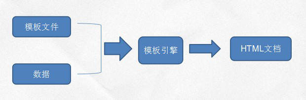
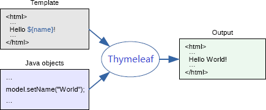
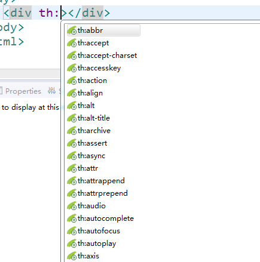

# **Thymeleaf**

## 一、模板引擎

### 1、什么是模板引擎

模板引擎（这里特指用于web开发的模板引擎）是为了是用户界面与业务数据（内容）分离产生的，它可以生成特定格式的文档，用于网站的模板引擎就会生成一个标准的HTML文档。

其实JSP就是一个早期的模板引擎，除了JSP，还有很多开源的模板引擎：

-   `Velocity `过时，不再更新和维护了

-   `Freemarker` 早几年占市场主流

- <font color=red>`Thymeleaf`</font>  Spring官方推荐

  ...

模板引擎工作原理：



### 2、Thymeleaf简介

`hymeleaf`一个现代化的服务器端基于Java的页面模板引擎。它通过将数据模型和页面分离，能帮我们重新构建更优雅的动态页面。

优点：

+ 唯一的前后端通用模板引擎，静态html嵌入标签属性，浏览器可以直接打开模板文件，便于前后端联调。
+ spring官方推荐。



模板引擎工作原理大都比较类似，都是通过一个基于模板引擎语法的模板文 件，把需要显示的模型数据和前端页面进行分离，使其更容易分开维护，体现了"前后分离"的思想。

使用模板引擎相对于JSP这样的动态页面的好处就是，JSP不通过服务器是生成不了Html文件的，直接用浏览器打开可读性差，而模板文件本身就是Html页面，程序员开发的时候修改调试非常方便。

## 二、SpringMVC整合Thymeleaf

### 1、引入库

```xml
<dependency>
    <groupId>org.thymeleaf</groupId>
    <artifactId>thymeleaf</artifactId>
    <version>3.0.9.RELEASE</version>
</dependency>
<dependency>
    <groupId>org.thymeleaf</groupId>
    <artifactId>thymeleaf- spring5</artifactId>
    <version>3.0.9.RELEASE</version>
</dependency>
```

`thymeleaf`为核心包，`thymeleaf-spring`为整合spring的依赖包，使用不同版本的spring，需要引入相应版本的`Thymeleaf`整合包。

### 2、基本配置

回顾一下之前使用JSP的时候，我们WebConfig中的关于视图解析器的配置：

```java
@Bean
public ViewResolver viewResolver() {
    InternalResourceViewResolver resolver = new InternalResourceViewResolver();
    // 设置视图前缀
    resolver.setPrefix("/");
    // 设置视图后缀
    resolver.setSuffix(".jsp");
    // 让上下文的bean在请求的属性中也可以访问
    resolver.setExposeContextBeansAsAttributes(true);
    return resolver;
}
```

通过这段配置，在controller返回视图逻辑名称的时候，spring会在这个逻辑名称的前后进行拼串，最终找到页面路径。

使用`Thymeleaf`，我们需要使用`Thymeleaf`提供的视图解析器来替换上面这段配置，我们将依次配置如下组件：

-   `SpringResourceTemplateResolver`（模板解析器）：加载`Thymeleaf`模板

-   `SpringTemplateEngine`（Spring模板引擎）：处理模板并渲染结果页面

-   `ThymeleafViewResolver`（视图解析器）：将逻辑视图名称解析为`Thymeleaf`模板视图

```java
@Bean
public ITemplateResolver templateResolver(ApplicationContext applicationContext)
{
    // 模板解析器
    SpringResourceTemplateResolver templateResolver = new
        SpringResourceTemplateResolver();
    //设置上下文(IOC容器)
    templateResolver.setApplicationContext(applicationContext);
    //设置前缀
    templateResolver.setPrefix("/");
    //设置后缀
    templateResolver.setSuffix(".html");
    //设置模板类型
    templateResolver.setTemplateMode(TemplateMode.HTML);
    templateResolver.setCacheable(false);// 开发时为了调试方便，禁用页面缓存
    //设置编码
    templateResolver.setCharacterEncoding("UTF-8");
    return templateResolver;
}
@Bean
public ISpringTemplateEngine templateEngine(ITemplateResolver templateResolver) {
    // 模板引擎
    SpringTemplateEngine templateEngine = new SpringTemplateEngine();
    // 支持SpEL(Spring的EL表达式)
    templateEngine.setEnableSpringELCompiler(true);
    //设置模板解析器
    templateEngine.setTemplateResolver(templateResolver);
    return templateEngine;
}
@Bean
public ViewResolver viewResolver(ITemplateEngine templateEngine) {
    // 视图解析器
    ThymeleafViewResolver viewResolver = new ThymeleafViewResolver();
    //设置模板引擎
    viewResolver.setTemplateEngine(templateEngine);
    //设置编码
    viewResolver.setCharacterEncoding("utf-8");
    return viewResolver;
}
```


## 3、Thymeleaf命名空间

在编制模板文件的时候，我们只需要在Html页面上的`html`节点中增加Thymeleaf命名空间就可以使用Thymeleaf了。

```html
<html xmlns:th="http://www.thymeleaf.org">
```


## 4、Thymeleaf的eclipse插件安装

为了在eclipse中编写thymeleaf有语法提示，我们需要安装thymeleaf的eclipse插件。

+ Help-\>Install New Software\...-\>Add-\>Archive\...

+ 插件地址为：http://www.thymeleaf.org/eclipse-plugin-update-site/ 

+ 勾选要安装的插件，一路next至安装完毕，安装完毕后会提示要重启eclipse（中间需要联网下载依赖，耗时有点久\...）

  ​			成功后就有提示了



## 三、HelloWorld

### 1、编写Controller代码

```java
@RequestMapping("/hello")
public String hello(Model model) {
    model.addAttribute("msg", "你好！");
    return "success";
}
```

### 2、编写模板文件

```html
<!DOCTYPE html>
<html xmlns:th="http://www.thymeleaf.org">
    <head>
        <meta charset="UTF-8">
        <title>Insert title here</title>
    </head>
    <body>
        <div th:text="${msg}"></div>
    </body>
</html>
```


## 四、标记

### 1. 接收参数

​	th:text=\"\${参数名}\" 或者 \[\[\${参数名}\]\] 

### 2. 域参数传递

1. 绑定参数

   ```java
   //域对象传递参数
   @RequestMapping("/inner")
   public String inner(HttpServletRequest request) {
       //请求域
       request.setAttribute("requestMsg", "请求域-张三");
       //回话域
       request.getSession().setAttribute("sessionMsg", "回话域-张三");
       //全局域
       request.getServletContext().setAttribute("applicationMsg", "全局域-张三");
       return "hello";
   }
   ```

2. 获取参数

   ```html
   <!DOCTYPE html>
   <html xmlns:th="http://www.thymeleaf.org">
       <head>
           <meta charset="UTF-8">
           <title>Insert title here</title>
       </head>
       <body>
           [[${requestMsg}]]
           [[${session.sessionMsg}]]
           [[${application.applicationMsg}]]
       </body>
   </html>
   ```

3. 迭代遍历

   th:each 例 如 ：th:each = \"car,stat:\${carList}\" 

   stat.index代表索引值，默认从0开始，例如：\[\[\${stat.index}\]\]

   例如：

   ```java
   @RequestMapping("/all")
   public String list(Model model){
       List<Car> list = carService.findAll();
       model.addAttribute("carList", list);
       System.out.println(list);
       return "new";
   }
   ```

   new.html

   ```html
   <table width="600" border="1">
       <thead>
           <tr>
               <th>id</th>
               <th>name</th>
               <th>type</th>
               <th>price</th>
           </tr>
       </thead>
       <tbody>
           <tr th:each="car,stat:${carList}">
               <td th:text="${car.id}"></td>
               <td>[[${car.name}]]</td>
               <td>[[${car.type}]]</td>
               <td>[[${car.price}]]</td>
           </tr>
       </tbody>
   </table>
   ```

### 3. 如何对时间、数字进行格式化

 thymeleaf提供了一系列内置对象：**以\#号开头**

**#dates** -日期格式化对象 例如：格式化年月日

```html
<td>[[${#dates.format(emp.hiredate,'yyyy年MM月dd日')}]]</td>
```

**\#numbers** -数字格式化对象 例如：格式化金额

```html
[[${#numbers.formatCurrency(emp.sal)}]]</td>
```

**\#strings** -字符串格式化对象 string对象就是java中的字符串对象，String提供的方法在\#strings一样去使用。(方法和Java中的Sring对象的方法一样)

```html
转小写<td>[[${#strings.toLowerCase(car.name)}]]</td>
 截取<td>[[${#strings.substring(car.type,0,1)}]]</td>
```

\#lists、\#sets、\#maps -集合操作对象

\...

### 4. 分支与判断

1. th属性中使用三目运算符

   ```html
   th:text="${emp.comm}!=null?${emp.comm}:'N/A'"
   ```

   例如岗位为经理和董事长的改变其样式

   ```html
   th:class="${emp.job == 'MANAGER' || emp.job == 'PRESIDENT'}?'highlight':''"
   ```

   例如工资大于1500的字体标红，highlight代表提前定义的类样式名。

   ```html
   th:style="${emp.sal>1500}?'color:red;font-weight:bold;':''"
   ```

   例如工资为空显示N/A，不为空显示金额格式。

   ```html
   <td th:text="${emp.comm == null}?'N/A':${emp.comm}"></td>
   ```

   

2. th:if / th:unless 判断标签是否输出

   + ```html
     <a href = "#" th:if="${size>0}">
     ```

   + ```html
     <a href = "#" th:unless="${size>0}"
     ```

   unless和if正好相反

   ```html
   <td th:unless="${car.id == 1}">111</td>
   ```

3. 多分支判断

   + th:switch th:case

     ```html
     <td th:switch="${car.type}">
         <span th:case="小轿车">111</span>
         <span th:case="越野车">222</span>
         <span th:case="*">333</span>
     </td>
     ```

### 5. 使用fragment构建高可用的网站框架

在编写网页代码时，我们可以通过`fragment`来定义一些html的代码片段，方便其它页面进行重 用。

1） fragment语法

+ 声明fragment：

  ```html
  <span th:fragment="片段变量名">
      html代码
  </span>
  ```

+ 引用fragment：

  ```html
  <div th:insert="模板文件名::片段变量名}"></div>
  ```

  selector可以是片段变量名、标签甚至是样式。

在引用`fragment`的时候我们可以使用`th:replace`、`th:insert`、`th:include`。

例如：

<font color=red>提取公共片段 header.html</font>

```html
<!DOCTYPE html>
<html xmlns:th="http://www.thymeleaf.org">
    <head>
        <meta charset="UTF-8">
        <title>Insert title here</title>
    </head>
    <body>
        <!-- 创建碎片 -->
        <div th:fragment="title">
            <h1>员工信息列表111</h1>
            。。。。
        </div>
    </body>
</html>
```

代码中定义了1个碎片：title。

为了使用刚才在模板文件中定义好的片段，我们可以在新建的用户列表页面list.html做出如下编码：

```html
<!DOCTYPE html>
<html xmlns:th="http://www.thymeleaf.org">
    <head th:replace="~{common::head('用户列表')}">
    </head>
    <body>
        <!-- 插入碎片 -->
        <div th:insert="header :: title"></div>
        ...
    </body>
</html>
```


## 五、案例

利用员工表，实现下列效果

1、第一列是序号，从1开始

2、名称默认小写

3、部门要求显示中文

4、经理、总裁高亮显示

5、入职时间显示"yyyy年MM月dd日"

6、工资大于1500的员工，姓名和工资标红，按货币形式表示

7、没有奖金的员工显示"N/A"

参考代码：

list.html

```html
<!DOCTYPE html>
<html xmlns:th="http://www.thymeleaf.org">
    <head>
        <meta charset="UTF-8">
        <title>Insert title here</title>
        <style type="text/css">
            .highlight{
                background: yellow
            }
        </style>
    </head>
    <body>
        <div th:insert="header::top"></div>
        <table border="1" width="100%">
            <tr>
                <th>序号</th>
                <th>编号</th>
                <th>姓名</th>
                <th>岗位</th>
                <th>上级领导编号</th>
                <th>入职日期</th>
                <th>工资</th>
                <th>奖金</th>
                <th>部门</th>
            </tr>
            <tr th:each="emp,stat:${list}" th:class="${emp.job == 'MANAGER' || emp.job == 'PRESIDENT'}?'highlight':''">
                <td th:text="${stat.index+1}"></td>
                <td th:text="${emp.empno}"></td>
                <td th:style="${emp.sal>1500}?'color:red;font-weight:bold;':''">[[${#strings.toLowerCase(emp.ename)}]]</td>
                <td>[[${emp.job}]]</td>
                <td>[[${emp.mgr}]]</td>
                <td>[[${#dates.format(emp.hiredate,'yyyy年MM月dd日')}]]</td>
                <td th:style="${emp.sal>1500}?'color:red;font-weight:bold;':''">[[${#numbers.formatCurrency(emp.sal)}]]</td>
                <td th:text="${emp.comm == null}?'N/A':${emp.comm}"></td>
                <td th:switch="${emp.deptno}">
                    <span th:case="10">财务部</span>
                    <span th:case="20">研发部</span>
                    <span th:case="30">销售部</span>
                    <span th:case="*">其他</span>
                </td>
            </tr>
        </table>
    </body>
</html>
```

header.html

```html
<!DOCTYPE html>
<html xmlns:th="http://www.thymeleaf.org">
    <head>
        <meta charset="UTF-8">
        <title>Insert title here</title>
    </head>
    <body>
        <div th:fragment="top">
            <h2 style="color:red;text-align:center;">员工信息展示</h2>
        </div>
    </body>
</html>
```


## 六、全站乱码问题

我们以前是自己写一个过滤器，现在SpringMVC已经给我们提供了`CharacterEncodingFilter`，我们直接拿来用即可。

在`SpringWebAppInitializer`类中重写`getServletFilters()`方法

```java
//设置全站乱码
//使用的式SpringMVC给我们提供的CharacterEncodingFilter
@Override
protected Filter[] getServletFilters() {
    //创建编码过滤器
    CharacterEncodingFilter encodingFilter = new CharacterEncodingFilter();
    //设置编码
    encodingFilter.setEncoding("UTF-8");
    encodingFilter.setForceEncoding(true);
    return new Filter[] {encodingFilter};
}
```


